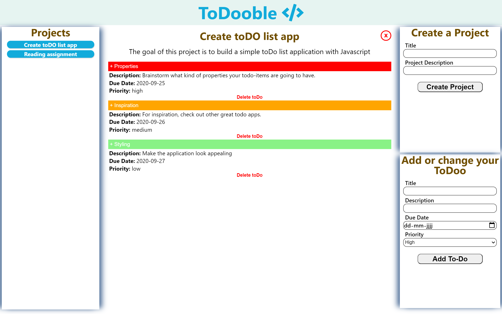

# to_do_list

This is a To Do List App using JavaScript and Webpack. With as goal learning how to apply Object Oriented Programming best practices.

## Built With

- Javascript
- HTML
- CSS

## Live Demo

[Live Demo Link](https://raw.githack.com/mikethreels/to_do_list/feature-branch/dist/index.html)

## Getting Started

To get a local copy up and running follow these simple example steps.

- Git clone https://github.com/mikethreels/to_do_list
- Open the index.html inside the dist folder with your favorite browser
- Explore the website

### Usage

- Navigate through all projects in the navigation pane on the left-hand side
- In the middle the currently selected project will be visible
- A project can be deleted by clicking on the red 'X' in the top right corner of the project
- Click on the todo's inside the project to expand or collapse the field below
- A todo can be deleted by clicking on 'Delete toDo' when the todo is expanded
- Create new projects by filling in the form in the 'Create a Project' window and click the button
- Create new todo's by filling in the form in the 'Add or change your ToDoo' window and click the button (the todo will be added to the currently selected project)
- Both a project and a todo can be adjusted by using the forms on the right-hand side entering the exsisting title.

## Author
👤 Michael Threels
- Github: [@mikethreels](https://github.com/mikethreels)
- Twitter: [@MichaelThreels](https://twitter.com/MichaelThreels)
- LinkedIn: [michaelthreels](https://www.linkedin.com/in/michael-threels)

## 🤝 Contributing

Contributions, issues and feature requests are welcome!

Feel free to check the [issues page](issues/).

## Show your support

Give a ⭐️ if you like this project!
